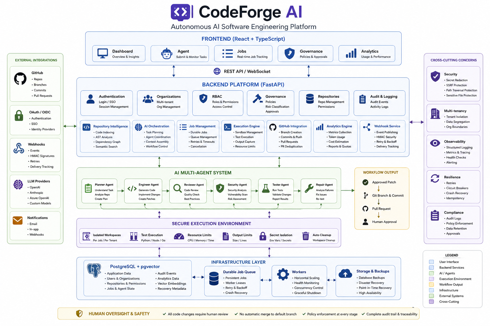

# CodeForge AI - Autonomous Multi-Agent Software Engineer

CodeForge AI is an autonomous, multi-agent software engineering system. Instead of a conversational chatbot, CodeForge AI operates as a coordinated team of specialized AI agents capable of analyzing software repositories, proposing architectural implementation plans, generating patch diffs, running sandboxed tests, executing iterative feedback repair loops, and opening Git branches and GitHub Pull Requests under strict human approval gates.

---

## Key Features

1. **GitHub App Integration**: Authenticates via GitHub App installations, securely cloning user repositories, mapping installations, and opening Pull Requests without exposing secrets.
2. **Repository Code Intelligence**: AST parsing (Python, TS/JS, Go), dependency manifest extraction, semantic code chunking, and pgvector-backed hybrid semantic code search.
3. **Multi-Agent Software Engineering Workflow**:
   - **Planner Agent**: Performs repository analysis, dependency inspection, and architectural plan creation.
   - **Code Engineer Agent**: Generates structured file patches adhering to strict size (20 files, 500 KB, 2 MB total) and safety boundaries.
   - **Code Reviewer Agent**: Evaluates code quality, architectural consistency, maintainability, and naming conventions.
   - **Security Reviewer Agent**: Scans patches for secrets, path traversal, injection, SSRF, broken auth, and tenant isolation leaks. Critical/High findings block automated PR generation.
   - **Test Engineer Agent**: Inspects changes, generates missing test cases, and runs automated tests inside an isolated sandbox.
   - **Debug/Repair Agent**: Analyzes test and review failures, executes an iterative bug-fixing loop (up to 3 iterations), and validates fixes.
   - **Orchestrator Agent**: Coordinates agent handoffs, enforces confidence thresholds (`0.70`, `0.80`, `0.85`), and halts execution at the **Human Review Required** gate.
4. **Durable Job Queue & Real-Time Monitoring**: Persistent background jobs (`AgentJob`), exponential backoff retries, cancellation flags, and real-time WebSocket progress streaming to React UI components.
5. **Secure Execution Sandbox**: Temporary isolated workspaces, path validation, secret-sanitized subprocess command execution, and test framework integration (pytest, vitest, jest, go test).
6. **Git Branch & Pull Request Automation**: Protected branch enforcement, patch SHA-256 fingerprint verification, feature branch generation (`codeforge/task-{short_id}`), secret scrubbing, and GitHub Pull Request creation.
7. **Production Deployment & Operational Readiness**:
   - **Structured JSON Logging**: Centralized JSON log formatter with secret redaction and context tracking (`X-Request-ID`, `user_id`, `repo_id`, `job_id`, `task_id`).
   - **Security Middlewares**: Request correlation tracing and strict HTTP response security headers (`nosniff`, `DENY`, referrer, XSS protection).
   - **Health & Readiness Probes**: Liveness probe (`GET /health`) and Readiness probe (`GET /ready`) verifying DB, `pgvector`, workspace root, and job worker health.
   - **Containerization**: Non-root multi-stage Docker containers (`codeforge:codeforge`), Gunicorn with Uvicorn ASGI workers, Nginx SPA proxying, and Docker Compose deployment stack.

---

## Technology Stack

### Frontend
- **Framework**: React (v19), TypeScript, Vite (v8)
- **Styling**: Vanilla CSS & Tailwind CSS (v4)
- **Routing**: React Router DOM (v7)
- **Icons**: Lucide React

### Backend
- **Framework**: FastAPI, Python 3.13
- **Database**: PostgreSQL with `pgvector` extension (SQLAlchemy ORM + Alembic migrations)
- **Task Orchestration**: Custom durable DB job worker with atomic transaction claims (`FOR UPDATE SKIP LOCKED`)
- **Testing**: pytest (183 backend unit & integration tests)

### AI Integration
- **LLM Engine**: Grok API (x.ai) compatibility layer with extensible `AIProvider` base class.

---

## Architecture Overview



```text
                               ┌──────────────────────────────────────────────┐
                               │           React + Vite Frontend             │
                               │  (Workflow Timeline, Findings, Real-Time WS)  │
                               └──────────────────────┬───────────────────────┘
                                                      │ REST / WebSockets
                               ┌──────────────────────▼───────────────────────┐
                               │               Nginx Reverse Proxy            │
                               └──────────────────────┬───────────────────────┘
                                                      │ HTTP / WS Proxying
                               ┌──────────────────────▼───────────────────────┐
                               │            FastAPI Backend Service           │
                               │  (Correlation ID, JSON Logs, Security Headers)│
                               └──────────┬───────────────────────┬───────────┘
                                          │                       │
                               ┌──────────▼───────────┐ ┌─────────▼───────────┐
                               │  PostgreSQL + vector │ │ Durable Job Worker  │
                               │   (Job Queue & DB)   │ │  (Multi-Agent Loop) │
                               └──────────────────────┘ └─────────┬───────────┘
                                                                  │
                                                        ┌─────────▼───────────┐
                                                        │ Isolated Sandbox    │
                                                        │ (Pytest/Vitest Exec)│
                                                        └─────────────────────┘
```

---

## Quick Start with Docker Compose (Recommended)

1. **Clone the repository and set up `.env`**:
   ```bash
   cp .env.example .env
   ```

2. **Configure mandatory environment variables in `.env`**:
   ```env
   ENVIRONMENT=production
   JWT_SECRET_KEY=your_strong_production_jwt_secret_key_32_chars_min
   POSTGRES_PASSWORD=your_secure_postgres_password
   ```

3. **Build and launch the container stack**:
   ```bash
   docker-compose up --build -d
   ```

4. **Verify container status & health**:
   ```bash
   docker-compose ps
   curl http://localhost/health
   curl http://localhost/ready
   ```

5. **Access CodeForge AI**:
   - Frontend Application: [http://localhost](http://localhost)
   - API Endpoints: [http://localhost/api/v1](http://localhost/api/v1)
   - Liveness Probe: [http://localhost/health](http://localhost/health)
   - Readiness Probe: [http://localhost/ready](http://localhost/ready)

---

## Local Development Prerequisites

- **Python**: 3.10+ (tested on Python 3.13.15)
- **Node.js**: 20+ (tested on Node 22.16.0)
- **PostgreSQL**: PostgreSQL 16+ instance with `pgvector` extension installed.

### Local Backend Setup

```bash
cd backend
python -m venv .venv
.venv/Scripts/activate        # On Windows (or source .venv/bin/activate on Linux)
pip install -r requirements.txt

# Run migrations
alembic upgrade head

# Run backend test suite (183 tests)
pytest -v

# Start development API server
uvicorn app.main:app --reload --port 8000
```

### Local Frontend Setup

```bash
cd frontend
npm install
npm run build                 # Verify TypeScript build
npm run dev                   # Start Vite dev server at http://localhost:5173
```

---

## Enterprise Reliability, Disaster Recovery & High Availability (Step 20)
CodeForge AI includes a production-grade enterprise reliability layer:
- **Worker Leases & Heartbeats**: Worker process lease tracking with automatic expired lease reclaiming.
- **Agent Workflow Checkpoint Recovery**: Resumes interrupted tasks, executions, and multi-agent runs from safe checkpoints.
- **Workspace Cleanup Safety**: Root-contained directory cleanup with path traversal protection and active workspace protection.
- **Backup & Restore Orchestration**: Automated `pg_dump` database backups, SHA-256 checksum verification, secret redaction, and preflight restore plan generation (requiring explicit administrator confirmation).
- **Disaster Recovery Readiness Diagnostics**: Consolidated diagnostic status for database, migrations, queue, worker heartbeats, storage, backups, and `pgvector`.
- **Diagnostics Endpoints**: Mounted at `/health/database`, `/health/workers`, `/health/recovery`, and `/health/detailed`.

---

## Verification & Compliance

- **Backend Test Suite**: 226/226 passed (`pytest -v`).
- **Frontend Type Check**: 0 errors (`npm run build`).
- **Database Migrations**: Applied through head revision `e7f10b284920`.

## Enterprise RBAC & Governance
CodeForge AI includes a full multi-tenant architecture with hierarchical role-based access control, cryptographic invitation handling, owner immutability protection, and immutable audit logs.

