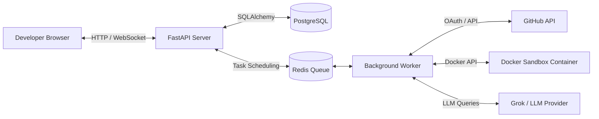
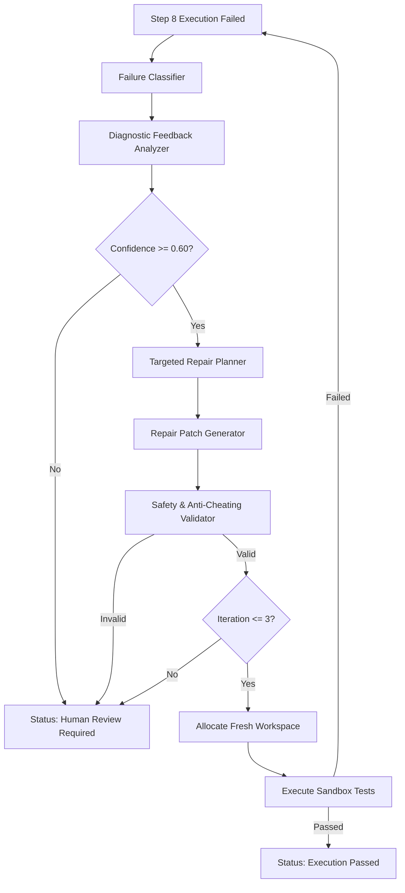

# CodeForge AI - Architectural Design Document

This document outlines the software design, structure, and future-looking considerations for **CodeForge AI**, an autonomous software engineering agent.

---

## 1. Project Purpose
CodeForge AI is a full-stack, autonomous software development agent. Unlike simple conversational chatbots, CodeForge AI is engineered to interact directly with code repositories. It performs analysis, writes implementation plans, receives developer authorization, performs multi-file code modifications, runs verification tests within isolated execution environments, and opens pull requests.

## 2. High-Level Architecture
CodeForge AI utilizes a decoupled, modern three-tier architecture:
- **Frontend Layer**: React + TypeScript + Vite single-page application.
- **Backend API Layer**: FastAPI serving as the orchestrator, handling database transactions, LLM routing, and task triggering.
- **Task Queue / Worker Layer (Future)**: A background worker (Redis + Celery/Arq) for executing long-running repository analysis and agent loops.
- **Safe Execution Sandbox (Future)**: Docker-based sandboxed runtime environment for checking code and running developer test suites.



---

## 3. Frontend Architecture
The frontend is built with React, TypeScript, and Vite, styled using Tailwind CSS. 
- **Modular Component Layout**: Views are divided into reusable pages, layouts, and components.
- **State Management**: React Context / Custom hooks are utilized for tracking project contexts, task statuses, and connection streams.
- **API Client**: A centralized API client communicating with `/api/v1` routes handles all backend requests, including SSE/WebSocket hooks for streaming logs from the active agent.

---

## 4. Backend Architecture
The backend is powered by FastAPI, leveraging Python's asynchronous features.
- **Layered Code Structure**:
  - `api/`: Route handlers split by features and versioned under `v1/`.
  - `core/`: Application settings, database session setup, exception definitions, and logging rules.
  - `providers/`: Integration adapters for external APIs (AI models, repository tools).
  - `services/`: Core orchestrator business logic coordinating repository edits, parsing LLM logs, and starting tasks.
  - `models/`: Declarative SQLAlchemy models.
  - `schemas/`: Pydantic data schemas representing request and response shapes.
  - `repositories/`: Database query isolation layer.

---

## 5. PostgreSQL & Database Layer
PostgreSQL serves as the primary transactional store.

### Database Architecture
- **ORM**: SQLAlchemy 2.0 with unified declarative mapping formats (`Mapped` and `mapped_column`).
- **Migrations**: Alembic manages schema version control. All migration scripts are located in `backend/alembic/versions/` and versioned under `alembic_version` in the database.
- **Multi-Database Compatibility**: Utilizes a custom `UTCDateTime` TypeDecorator to ensure that all timestamps read from database engines (including SQLite during unit testing and PostgreSQL in production) are returned as timezone-aware UTC `datetime` objects in Python.

### Core Entity: User Model (`users` table)
| Column Name | Database Type | Python Type | Constraints | Description |
| :--- | :--- | :--- | :--- | :--- |
| `id` | `UUID` | `uuid.UUID` | Primary Key, Index, default=UUIDv4 | Unique identifier for each user |
| `email` | `VARCHAR(255)` | `str` | Unique, Index, Non-nullable | User email used for sign-in |
| `hashed_password` | `VARCHAR(255)` | `str` | Non-nullable | Password hash (plaintext placeholder for Step 2) |
| `is_active` | `BOOLEAN` | `bool` | Non-nullable, default=True | Active flag to manage access status |
| `created_at` | `TIMESTAMP WITH TZ` | `datetime` | Non-nullable, default=UTC Now | Timestamp when row was inserted |
| `updated_at` | `TIMESTAMP WITH TZ` | `datetime` | Non-nullable, default=UTC Now, onupdate=UTC Now | Timestamp when row was last modified |

---

## 6. AI Provider Abstraction
To avoid vendor lock-in, CodeForge AI abstracts LLM calls behind a unified interface:
- **`AIProvider` Base Class**: Defines async methods for text generation, structured JSON output, code inspection, and code synthesis.
- **Provider Registry**: Dynamically loads and selects providers (e.g. Grok, OpenAI, Anthropic, or local models using Ollama) based on settings.

---

## 7. Grok as Initial Provider
- **Grok API**: Serves as the initial LLM backend.
- **Compatibility**: Grok's REST endpoint is OpenAI-compatible, allowing standard headers and request shapes.
- **Configuration**: Managed via `GROK_API_KEY` and `GROK_MODEL` variables in the `.env` configuration.

---

## 8. Future GitHub Integration
- **GitHub Apps API**: Authenticates as an installed App, providing access control to user-authorized repositories.
- **Repository Operations**: The agent clones repositories locally to a temporary workspace on the worker node, checks out unique feature branches, runs modifications, and uses git commands to commit and push changes.

---

## 9. Future Agent Architecture
CodeForge AI will operate on a structured, multi-step agent loop:
1. **Repository Indexing**: Parse code structures and populate search indexes.
2. **Analysis**: Inspect task descriptions and files to locate components that need editing.
3. **Plan Generation**: Construct detailed steps for the implementation, displaying file diffs for user authorization.
4. **Iterative Refinement**: Execute changes, run test suites, capture compiler or test errors, and feedback logs back to the LLM to patch fixes.

---

## 10. Future Sandbox Architecture
- **Isolation Goal**: Generated code and test suites cannot execute on the main worker instance.
- **Implementation**: The worker mounts cloned workspaces into a specialized, temporary Docker container with specific CPU/Memory limits and no external internet access (except to download local dependencies if explicitly allowed).

---

## 11. Security Considerations
Security is critical for an autonomous code agent:
- **Credential Storage**: Access tokens, API keys, and repository credentials must be stored encrypted at rest.
- **Workspace Cleaning**: Cloned repositories and temporary build artifacts must be fully wiped from the host environment upon completion.
- **API Guardrails**: All external modifications (e.g. pushes, PR creation) must require double-authorization from the user.

---

## 12. Why Generated Code Must Run in an Isolated Sandbox
Running code generated by an LLM poses substantial risks:
- **Malicious Code Execution**: LLMs are susceptible to prompt injection attacks, which could instruct them to execute malicious commands like `rm -rf /` or steal active host environment variables.
- **Dependency Exploitation**: The LLM might install packages containing malicious scripts that run on setup.
- **Infinite Loops & Memory Exhaustion**: Generated code might contain infinite loops or memory leaks that could crash the host system if not CPU/Memory constrained.

Therefore, the sandboxed environment acts as a secure container where code failures, infinite loops, and security compromises are contained, preserving host integrity.

---

## 13. User Authentication & Authorization (Step 3)
CodeForge AI implements a secure local email/password authentication system.

### Password Cryptography
- **Hashing**: Plaintext passwords are never stored or logged. They are hashed using `bcrypt` directly (bypassing legacy/deprecated libraries like `passlib` to ensure full Python 3.13 compatibility).
- **Constant-Time Verification**: Password checks are verified using `bcrypt.checkpw` which executes in constant time to eliminate side-channel timing attacks.
- **Timing Defense**: During login checks, lookup routines run validation checks against a dummy bcrypt hash if the email address does not exist. This keeps processing latency uniform, preventing user enumeration attacks.

### Token Architecture (JWT)
- **Format**: Signed JSON Web Tokens (JWT) are used as session tokens.
- **Payload Claims**:
  - `sub`: Stores the user's UUID.
  - `iat`: Timestamp of token issuance.
  - `exp`: Timestamp of token expiration (typically set to 30 minutes).
- **Signing**: Tokens are signed using `HMAC-SHA256` (`HS256`).
- **Signature Security**: The signing secret key `JWT_SECRET_KEY` is loaded from environment variables and is mandatory in non-test modes. The algorithm is strictly checked upon decoding, rejecting mismatching algorithms.

### Request Interception & Middleware
- **FastAPI Dependency**: The reusable dependency `get_current_user` extracts the Bearer token, validates signature/expiration, resolves the profile in PostgreSQL, checks the `is_active` status, and yields the `User` object.
- **Client Cache**: The frontend caches the token in `localStorage`. Outgoing fetch commands automatically hook the Bearer token to the `Authorization` header. Expired sessions trigger cleanup and route redirection to `/login`.

---

## 14. GitHub App Integration (Step 4)
CodeForge AI interacts with GitHub repositories through a GitHub App installation context rather than personal user OAuth tokens.

### Secure State Validation Flow
- **Generation**: Clicking "Connect GitHub" triggers a secure endpoint producing a cryptographically random url-safe token. The backend calculates its SHA-256 hash and commits it to the `oauth_states` table in PostgreSQL mapped to the active `user_id` with a 10-minute expiration.
- **Validation**: When the setup redirect occurs, the backend takes the raw token param, hashes it, queries `oauth_states`, and validates that:
  - The record is found and matches the hash.
  - The token has not expired.
  - The token has not been used (`used_at` flag is null), preventing reuse replay attacks.
  - The token gets immediately invalidated by setting `used_at = now()`.
- **User Binding**: Links the confirmed `installation_id` to the CodeForge `user_id` originally associated with the state token. This guarantees that user connections are fully isolated and secure.

### Server-side Token Exchange & JWT
- **App JWT**: The backend generates RS256-signed JWTs using the configured App ID and the RSA private key PEM file loaded from the server's isolated storage. Token durations are capped at 9 minutes.
- **Installation Token**: The backend exchanges the App JWT for a short-lived, narrow-scoped installation access token from the GitHub API on a per-request basis.
- **Exposure Protection**: Neither the App JWT nor the installation access tokens are ever returned in API responses, stored permanently in the database, or logged, ensuring complete server-side encapsulation.

### Repository Listing & Redaction
- The `GET /github/repositories` endpoint contacts GitHub using the transient installation access token, parses the JSON payload, and formats it into safe repository metadata objects.
- Returned metadata includes only fields like `name`, `full_name`, `private`, `html_url`, and `default_branch`. All GitHub access credentials are completely redacted before the response is returned to the React frontend.


## 15. Repository Management & Codebase Understanding (Step 5)

### Secure Workspace Isolation
- **Base Root**: A centralized, configurable folder `<project-root>/workspaces/` is established on the server.
- **Isolate Subfolders**: Each imported repository is stored under an isolated path using backend-generated IDs:
  `workspaces/user_<user_id>/repo_<github_repo_id>/`
- **Ownership Verification**: Before any codebase access, tree walk, file read, or project deletion, the backend checks that the `user_id` of the database repository record matches the authenticated request's user context. Users can never provide or modify workspace paths directly.

### Centralized Safe-Path Validation
- The utility function `get_safe_workspace_path` secures all disk activities:
  - **Raw Input Blocking**: Rejects paths containing absolute Unix flags (`/`), Windows roots (`C:\`), UNC structures (`\\`), drive colons (`:`), or `os.path.isabs(path)`.
  - **Traversal Segment Scrapes**: Rejects any relative segment containing traversal parameters `..` after separator normalizations.
  - **Directory Boundary Checks**: Employs `os.path.commonpath` comparing the base repository path and resolved targets, blocking sibling workspace access exploits.

### ZIP Bomb & Extraction Security
- **Download Exchange**: The backend streams the codebase as a ZIP archive directly from the GitHub API using the short-lived installation access token.
- **Resource Constraints**: Extraction validates archive items in-memory and raises exceptions if:
  - Total extracted size exceeds `50MB`.
  - Total file count exceeds `1000` files.
- **Extraction Filtering**: Skip any ZIP records attempting path traversal or mapping to absolute Unix/Windows directories. Exclude `.git/` folder contents from extracting to prevent control structure pollution.
- **Safe Recoveries**: Errors are captured safely. On extraction failure, database records are marked `"failed"` with clean logs, and temporary folders are deleted.

### Codebase Indexing & Walk Pruning
- An asynchronous index walker processes directories recursively:
  - **Folder Exclusions**: Skips control and temporary folders: `.git`, `node_modules`, `venv`, `.venv`, `__pycache__`, `dist`, `build`, `.next`, `.nuxt`.
  - **File Exclusions**: Excludes binary files and sensitive extensions/names (like `.pem`, `.key`, `.env`, `id_rsa`, etc.).
  - **Metadata Metrics**: Calculates language breakdown ratios and parses package/dependency logs (like `package.json`, `requirements.txt`, `pyproject.toml`) to detect frameworks (e.g. React, Next.js, FastAPI, Django).

### Secure File Reader API
- Mounts `GET /api/v1/repositories/{repo_id}/file?path=<relative_path>`.
- Enforces a maximum readable file size limit of `1MB`.
- Blocks access to binary files and files matching the exclusion rules, ensuring credentials and binary builds are never returned.


## 16. AI Codebase Understanding & Repository Intelligence (Step 6)

### Knowledge Base Database Schema
- **`SourceFile`**: Tracks scanned source files with SHA-256 hash for incremental re-indexing.
- **`Symbol`**: AST-extracted code symbols (classes, methods, functions, API routes, imports).
- **`CodeChunk`**: Semantic text chunks with vector embeddings.
- **`RepositoryAnalysis`**: Analysis metadata, architecture summaries, and framework detections.

### Dual-Mode Vector Storage (`HybridVector`)
- Decoupled `TypeDecorator` mapping:
  - **PostgreSQL**: `vector(1536)` with HNSW index and pgvector extension.
  - **SQLite**: `TEXT` storing JSON-serialized float vectors (enables offline test suite execution).

### Multi-Language Code Parsing & Semantic Chanking
- AST-based parsing for Python (`ast` module) and regex parsing for TypeScript, JavaScript, and Go.
- Symbol-level code chunking with max-line boundary rules (120 lines max, 20-line overlap).
- Precise dependency parsing for `requirements.txt`, `package.json`, `go.mod`, `Cargo.toml`, `pyproject.toml`, `Pipfile`, `yarn.lock`, and `package-lock.json`.


## 17. AI Software Engineer Agent - Planning & Code Generation (Step 7)

### Provider-Agnostic Agent Architecture
- Built on `BaseAIProvider` abstraction (`GrokProvider` implementation with deterministic test mock provider).
- Modular architecture comprising orchestration, context retrieval, implementation planning, code generation, diff representation, and security validation.

### Agent Task Model & Database State Lifecycle (`agent_tasks` table)
- Tracks user engineering requests through distinct pipeline statuses:
  `pending` → `analyzing` → `planning` → `generating` → `ready_for_review` (or `failed`)
- Stores structured implementation plan, analyzed file lists, target file lists, generated patch diffs, and error messages.

### Bounded Context Window Retrieval
- Leverages Step 6 repository intelligence:
  - Repository overview, architecture summary, detected frameworks, entry points, and dependencies.
  - AST symbol matching against task keywords.
  - Semantic code chunk retrieval.
  - Source file snippet loading up to a strict token budget limit (12,000 estimated tokens).

### Implementation Planner
- Generates a structured Pydantic implementation plan (`ImplementationPlanSchema`):
  - Task summary & architecture understanding.
  - Relevant files & extracted symbols.
  - Proposed file edits & dependency impacts.
  - Implementation steps & required unit tests.
  - Security, compatibility, & architectural risk analysis.

### Code Synthesis & Unified Patch Representation
- Synthesizes file operations (`create`, `modify`, `delete`) matching `CodeGenerationResponseSchema`.
- Computes standard unified diffs (`a/filepath` vs `b/filepath`) for frontend rendering.

### Multi-Layer Security Controls
- **Path Traversal Protection**: All proposed paths pass through `get_safe_workspace_path`.
- **Absolute & Traversal Rejection**: Blocks Unix absolute paths (`/`), Windows roots (`C:\`), UNC paths (`\\`), drive colons (`:`), and `..` traversal sequences.
- **Sensitive & Excluded File Protection**: Rejects `.env`, `.pem`, `.key`, `id_rsa`, `.git`, `node_modules`, `__pycache__`, `.venv`, etc.
- **Operation Validation**: `modify` and `delete` must target existing workspace files.
- **Volume & Size Limits**: Capped at maximum 20 modified files per task and 500 KB maximum file size.
- **Zero Auto-Commit Safety**: Proposed changes are stored as structured patches in PostgreSQL for user review — **never written directly to Git or disk without explicit developer authorization**.

### API Endpoints & Tenant Isolation
- `POST /api/v1/repositories/{repo_id}/agent/tasks` (202 Accepted)
- `GET /api/v1/repositories/{repo_id}/agent/tasks`
- `GET /api/v1/repositories/{repo_id}/agent/tasks/{task_id}`
- `GET /api/v1/repositories/{repo_id}/agent/tasks/{task_id}/plan`
- `GET /api/v1/repositories/{repo_id}/agent/tasks/{task_id}/changes`
- Enforces strict JWT authentication and repository/task ownership isolation across user accounts.


## 18. Secure Code Execution & Automated Testing (Step 8)

### Execution Model & Database Schema (`agent_executions` table)
- **`AgentExecution` model**:
  - `id`: UUID primary key
  - `task_id`: UUID foreign key to `agent_tasks.id` (CASCADE delete)
  - `status`: `pending` → `preparing` → `applying` → `testing` → `passed` / `failed` / `cancelled`
  - `workspace_path`: Isolated temporary directory path (`workspaces/executions/exec_<execution_id>`)
  - `command_results`: JSON array of executed sandboxed command records
  - `test_summary`: JSON object containing aggregated test stats (`passed`, `tests_run`, `tests_passed`, `tests_failed`, `tests_skipped`, `duration_seconds`, `failures`)
  - `stdout`, `stderr`, `exit_code`, `started_at`, `completed_at`, `error_message`

### Execution Architecture & Components (`app/services/execution/`)
- **Workspace Manager (`workspace_manager.py`)**: Creates temporary execution workspace separate from original repository workspace, copies required non-excluded files, and automatically cleans up temporary folders after execution.
- **Patch Applier (`patch_applier.py`)**: Applies approved `AgentTask` patch changes (`create`, `modify`, `delete`) ONLY inside temporary execution workspace, validating every target path against security rules.
- **Command Runner (`command_runner.py`)**: Sandboxed command runner executing subprocesses without `shell=True`. Enforces configurable timeouts (default 60s), max stdout/stderr size limits (500 KB limit), process termination, and environment variable sanitization.
- **Test Detector (`test_detector.py`)**: Inspects workspace files to discover trusted test frameworks (Python `pytest`/`unittest`, Node `npm test`/`vitest`/`jest`, Go `go test`/`go vet`). Only runs discovered or predefined safe commands.
- **Result Parser (`result_parser.py`)**: Parses stdout/stderr output into standardized structured summaries (`passed`, test counts, duration, failure items).

### Environment Security & Secret Isolation
- Subprocesses executed in the sandbox run with a minimal sanitized environment (`PATH`, `SYSTEMROOT`, `TEMP`, `TMP`, `PYTHONPATH`, `LANG`, `HOME`, `NODE_ENV`, `GOPATH`).
- Explicitly strips all host secrets, database URLs, JWT keys, GitHub app credentials, Grok API keys, and `.env` values.

### Execution API Endpoints
- `POST /api/v1/repositories/{repo_id}/agent/tasks/{task_id}/execute` (Triggers asynchronous execution, returns 202 Accepted)
- `GET /api/v1/repositories/{repo_id}/agent/tasks/{task_id}/executions` (Lists execution history for task)
- `GET /api/v1/repositories/{repo_id}/agent/tasks/{task_id}/executions/{execution_id}` (Retrieves execution detail)

---

## 19. Git Branch Management & GitHub Pull Request Automation Architecture (Step 9)

### Key Architectural Principles
- **Protected Branch Safety**: CodeForge AI never pushes directly to or modifies default git branches (`main`, `master`, `develop`, `release*`).
- **Explicit User Approval Gate**: No git branches are created or remote changes pushed without an explicit `is_approved = True` database flag set by the authenticated user.
- **SHA-256 Patch Fingerprint**: Computes a deterministic hash over proposed file changes to guarantee that approved content matches the exact content pushed to remote repositories.
- **Secret Scrubbing**: Strips tokens, credentials, and sensitive headers from git subprocess invocations and remote URLs.

---

## 20. AI Agent Feedback Loop & Autonomous Bug Fixing Architecture (Step 10)

### Key Architectural Principles
- **Diagnostic Traceback Analysis**: Parses execution stdout, stderr, and test summaries to classify failure modes across Python, Node.js, and Go ecosystems.
- **Diagnostic Confidence Threshold**: Evaluates diagnostic confidence (0.0 to 1.0). Rejects automatically applying repairs if confidence < 0.60, triggering `human_review_required`.
- **Anti-Cheating Patch Validation**: Explicitly rejects any generated repair that attempts to delete test files (`*_test.py`, `*.test.ts`), introduce skip directives (`@pytest.mark.skip`, `it.skip`), or weaken security path checks.
- **Fresh Execution Workspace Allocation**: Each repair attempt is executed inside a newly allocated, isolated temporary workspace in `workspaces/executions/`.
- **Iteration Limits**: Strictly enforces `MAX_REPAIR_ITERATIONS = 3`. If tests still fail after 3 iterations, the task halts safely and transitions to `human_review_required`.



### GitOperation Model (`git_operations` table)
| Column Name | Database Type | Python Type | Constraints | Description |
|---|---|---|---|---|
| `id` | `UUID` | `uuid.UUID` | Primary Key, Indexed | Unique identifier for Git/PR operation |
| `repository_id` | `UUID` | `uuid.UUID` | Foreign Key (`repositories.id`), OnDelete CASCADE, Indexed | Linked repository |
| `task_id` | `UUID` | `uuid.UUID` | Foreign Key (`agent_tasks.id`), OnDelete CASCADE, Indexed | Linked AgentTask |
| `execution_id` | `UUID` | `uuid.UUID` | Foreign Key (`agent_executions.id`), OnDelete CASCADE, Nullable | Linked passed execution run |
| `user_id` | `UUID` | `uuid.UUID` | Foreign Key (`users.id`), OnDelete CASCADE, Indexed | Authenticated user |
| `operation_type` | `String(50)` | `str` | Default "pull_request", Indexed | Operation mode (`branch`, `commit`, `push`, `pull_request`) |
| `status` | `String(50)` | `str` | Default "pending", Indexed | Status (`pending`, `preparing`, `applying`, `committing`, `pushing`, `creating_pr`, `completed`, `failed`, `cancelled`) |
| `branch_name` | `String(255)` | `str` | Not Nullable | Feature branch name (`codeforge/task-{short_id}`) |
| `commit_sha` | `String(64)` | `str` | Nullable | Git commit SHA |
| `remote_branch` | `String(255)` | `str` | Nullable | Remote pushed branch name |
| `pull_request_number` | `Integer` | `int` | Nullable | GitHub Pull Request number |
| `pull_request_url` | `String(512)` | `str` | Nullable | Public GitHub Pull Request URL |
| `commit_message` | `Text` | `str` | Nullable | Sanitized commit title |
| `error_message` | `Text` | `str` | Nullable | Error log if operation fails |
| `started_at` | `DateTime` | `datetime` | Nullable | Pipeline start timestamp |
| `completed_at` | `DateTime` | `datetime` | Nullable | Pipeline completion timestamp |

### Execution Workflow
1. **Explicit Task Approval**:
   - Developer reviews generated patch diffs and calls `POST /approve`.
   - CodeForge computes a SHA-256 fingerprint hash (`approved_patch_hash`) of the approved patch changes.
   - Sets `task.is_approved = True` and records `task.approved_at`.

2. **Pre-flight Safety Checks**:
   - `POST /pull-request` verifies `task.is_approved == True`.
   - Verifies current patch fingerprint matches `task.approved_patch_hash`. Re-approval is mandated if files were modified after approval.
   - Verifies at least one successful test execution (`execution.status == "passed"`) exists for the task.
   - Prevents duplicate PR creation by checking for existing open PRs on the head branch.

3. **Isolated Git Operations Workspace**:
   - Creates a temporary Git workspace (`workspaces/git_ops/git_<git_op_id>`).
   - Copies repository source files cleanly, ensuring original user workspace is untouched.

4. **Branch & Commit Pipeline**:
   - Generates standardized feature branch name: `codeforge/task-{short_id}`.
   - Rejects protected default branches (`main`, `master`, `develop`, `production`, `release*`).
   - Rejects branch names containing `..`, spaces, or shell metacharacters.
   - Applies approved patch files and verifies no sensitive files (`.env`, `.pem`, private keys) or excluded extensions are committed.
   - Commits changes with formatted message `CodeForge: {task_description}` and captures commit SHA.

5. **Authenticated Push & PR Creation**:
   - Obtains a short-lived GitHub App installation access token.
   - Sets temporary authenticated remote URL, pushes feature branch, and immediately scrubs credentials from git config.
   - Invokes `GitHubPRService.create_pull_request` to open a Pull Request targeting the repository's default branch.
   - Formats comprehensive PR body detailing summary, modified files, test execution metrics, and CodeForge Attribution.
   - Stores `pull_request_number` and `pull_request_url` in database and cleans up temporary Git operation workspace.

---

## 13. Step 13: Production Deployment, Containerization & Operational Readiness

### Overview
Step 13 equips CodeForge AI with a production-grade infrastructure, structured JSON logging, correlation context tracing, security headers, health/readiness diagnostic endpoints, and containerized microservices orchestration.

### Architecture Topology
```text
                       ┌────────────────────────────────────────┐
                       │          Nginx Reverse Proxy           │
                       │     (Port 80 -> SPA + /api/ Proxy)     │
                       └───────────────────┬────────────────────┘
                                           │
                     ┌─────────────────────┴─────────────────────┐
                     │                                           │
        ┌────────────▼────────────┐                 ┌────────────▼────────────┐
        │   FastAPI Web Server    │                 │   Job Worker Process    │
        │   (CONTAINER_ROLE=api)  │                 │  (CONTAINER_ROLE=worker)│
        │  Gunicorn + Uvicorn     │                 │   Durable Job Loop      │
        └────────────┬────────────┘                 └────────────┬────────────┘
                     │                                           │
                     └─────────────────────┬─────────────────────┘
                                           │
                               ┌───────────▼───────────┐
                               │  PostgreSQL 16 DB     │
                               │   + pgvector Ext.     │
                               └───────────────────────┘
```

### Production Components

1. **Fail-Fast Production Validation (`app.core.config.py`)**:
   - Validates environment variables during startup.
   - Rejects default or placeholder `JWT_SECRET_KEY` in production mode.
   - Forbids wildcard CORS origins (`*`) when `ENVIRONMENT=production`.

2. **Structured JSON Logging & Secret Redaction (`app.core.logging.py`)**:
   - Outputs single-line JSON log events containing `timestamp`, `level`, `name`, `message`, `request_id`, `user_id`, `repo_id`, `job_id`, and `task_id`.
   - Automatically sanitizes sensitive patterns (JWT tokens, API keys, private keys, passwords).

3. **Middlewares & Security Controls (`app.core.middleware.py`)**:
   - **Correlation ID Middleware**: Assigns or propagates `X-Request-ID` across HTTP requests and logs.
   - **Security Headers Middleware**: Injects `nosniff`, `DENY`, `strict-origin-when-cross-origin`, and `1; mode=block` security headers on all HTTP responses.

4. **Centralized Exception Handlers (`app.core.exceptions.py`)**:
   - Catch `HTTPException`, `RequestValidationError`, and unhandled global exceptions.
   - Returns safe, structured JSON responses without leaking internal stack traces or database connection strings.

5. **Liveness & Readiness Probes (`app.main.py`)**:
   - **Liveness (`GET /health`)**: Verifies API process is running.
   - **Readiness (`GET /ready`)**: Verifies database connectivity, `pgvector` extension availability, workspace directory permissions, and job worker queue status.

6. **Multi-Stage Container Stack (`Dockerfile`, `docker-compose.yml`)**:
   - **Backend**: Non-root container (`codeforge:codeforge`) built on `python:3.13-slim`. Runs Gunicorn with Uvicorn ASGI workers. Automatically executes `alembic upgrade head` before process startup.
   - **Frontend**: Multi-stage build (`node:20-alpine` -> `nginx:alpine`). Serves Vite SPA assets with Gzip compression and WebSocket HTTP `Upgrade` headers.
   - **Database**: PostgreSQL 16 image equipped with `pgvector` vector extension (`pgvector/pgvector:pg16`).

---

## 21. Step 20: Enterprise Reliability, Disaster Recovery, Backup & High Availability Architecture

### Core Reliability Architecture
- **Database Resilience**: Configured connection pool recycling (`pool_recycle=1800`), transient error retry decorator (`with_db_retry`), and connectivity diagnostics.
- **Durable Worker Leases**: Workers claim background jobs by acquiring database leases with automatic periodic heartbeats. Expired worker leases are automatically reclaimed.
- **Agent Workflow Checkpoint Recovery**: Resumes interrupted `AgentTask`, `AgentExecution`, `AgentIteration`, and `AgentRun` instances from safe checkpoints without re-generating plans or bypassing approval gates. Non-idempotent operations (such as Git PR creation) require manual review on crash.
- **Workspace Cleanup Safety**: Enforces containment checks (`is_path_safe_for_cleanup`) to restrict deletions strictly to temporary execution folders within the workspace root.
- **Backup & Restore Infrastructure**: Automated PostgreSQL database dumps (`pg_dump`), SHA-256 checksumming, secret redaction, and preflight restore plan generation requiring explicit administrator confirmation.
- **Disaster Recovery Readiness Diagnostics**: Consolidates health statuses across database, migrations, queue, worker leases, storage, backups, and pgvector.
- **High Availability (HA)**: Distributed leader lease management for multi-instance background task coordination.


